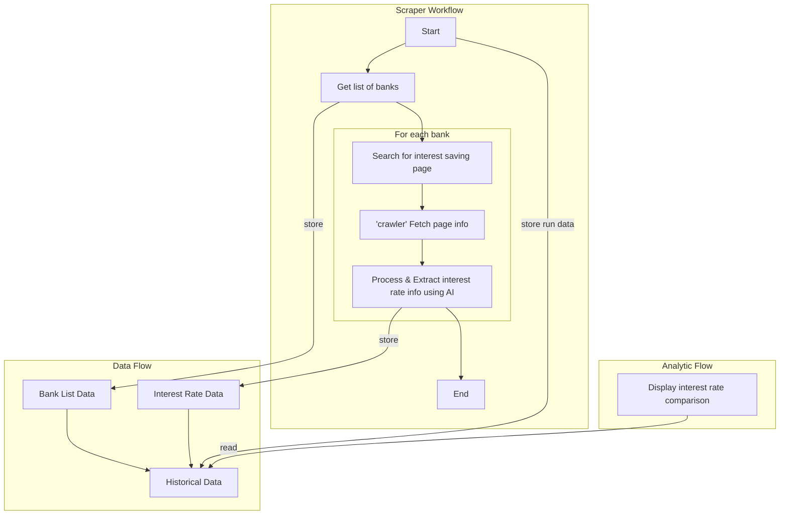

# Retrieve interest rate

## Proposed flow



## Components

Connect to each other like this: Retriever > Extractor > Viewer

### Retriever
Input: list of banks (fixed in code for now)\
Process: search for first result and get HTML content\
Output: raw HTML of interest rate pages

* Install

```sh
# current directory: `retriever` folder
npm i
```

* Run

```sh
# current directory: `retriever` folder
npm run dev
```

### Extractor
Input: raw HTML of interest rate pages\
Process: extracst interest rate data\
Output: store interest rate data

### Viewer
Input: interest rate data\
Process: View\
No output
